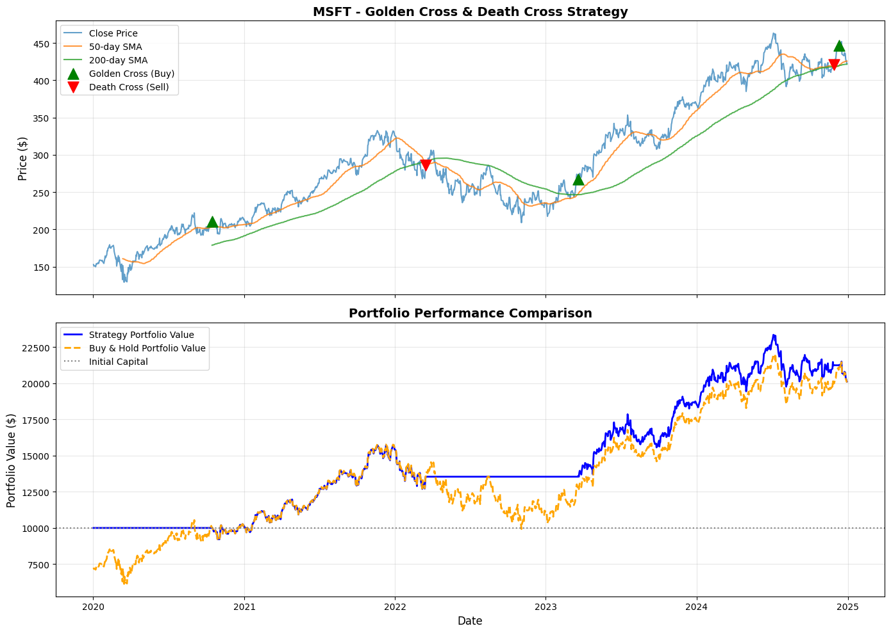
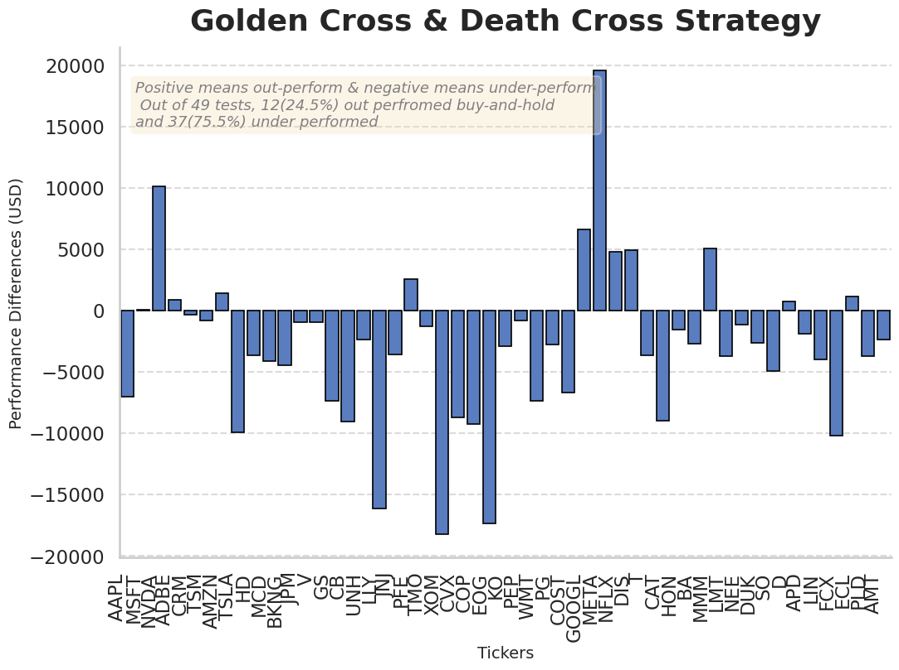

# 📈 Golden Cross & Death Cross Strategy Evaluation

This Jupyter Notebook analyzes the **Golden Cross** and **Death Cross** trading strategies using historical stock price data. The goal is to evaluate their effectiveness, simulate trade outcomes, and visualize performance over time.

---

## 🧠 Overview

The **Golden Cross** and **Death Cross** are popular technical analysis signals derived from moving averages:

- **Golden Cross:** Occurs when the short-term moving average (e.g., 50-day) crosses **above** the long-term moving average (e.g., 200-day), indicating potential upward momentum.
- **Death Cross:** Occurs when the short-term moving average crosses **below** the long-term moving average, signaling potential bearish momentum.

This notebook:
- Collects historical stock data using Python
- Calculates moving averages
- Identifies Golden and Death Cross events
- Backtests performance using these signals
- Visualizes buy/sell points and overall returns

---

## 🧰 Project Structure

```
golden-death-cross/
│
├── data/                      # Directory to load and store data
├── Golden_Death_Cross.ipynb   # Main analysis notebook
├── requirements.txt           # List of dependencies
└── README.md                  # Project description
```
---

## 📊 Key Steps

1. **Data Gathering**
   - Fetch historical stock prices using `yfinance` or other APIs.

2. **Data Processing**
   - Calculate short-term and long-term moving averages.
   - Detect crossover points for Golden and Death Cross.

3. **Backtesting**
   - Simulate buy/sell trades at each signal.
   - Compare strategy performance against buy-and-hold.

4. **Visualization**
   - Plot price data with crossover markers.
   - Display cumulative returns and drawdowns.

---

## 🧪 Example Output

- 📅 Historical stock price chart  
- 🔁 Buy/Sell markers for each cross event  
- 📈 Comparison between strategy vs. benchmark returns  

*Mircrosoft Adjusted Close 2020-2024*  




*Test on 49 Stocks, the majority under perform simply buy and hold*  




---

## 🛠️ Dependencies

To install required packages:

```bash
pip install -r requirements.txt
```

Typical dependencies include:

```text
pandas
numpy
matplotlib
plotly
yfinance
```

---

## 🚀 How to Run

1. Clone the repository:

   ```bash
   git clone https://github.com/KuoLiang-hub/golden-cross-evaluation
   cd golden-cross-evaluation
   ```

2. Install dependencies:

   ```bash
   pip install -r requirements.txt
   ```

3. Launch Jupyter Lab:

   ```bash
   jupyter lab .
   ```

4. Open **Golden_Death_Cross.ipynb** and run all cells.

---

## 📚 Learn More

* [Investopedia: Golden Cross Definition](https://www.investopedia.com/terms/g/goldencross.asp)
* [Investopedia: Death Cross Definition](https://www.investopedia.com/terms/d/deathcross.asp)

---

## 📄 License

This project is licensed under the MIT License — see the [LICENSE](LICENSE) file for details.

---

## 👩‍💻 Author

**Kuo Liang**
📧 Linkedin: [[Kuo Liang](https://www.linkedin.com/in/kuo-l-32968a211/)]
💼 GitHub: [@KuoLiang-hub](https://github.com/KuoLiang-hub)

---

*“Trade with logic, not emotion.”*
